# Linksy

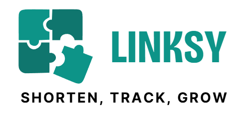

# Overview

Linksy is a fullstack URL management application that lets you generate short links, group them together, and track detailed statistics like click counts and traffic sources. It works a lot like Bitly, giving you the tools to analyze how your links are performing in real-time. On top of link shortening, you can also create QR codes and build simple landing pages to act as a professional showcase for your business.

The entire system is built with a modern tech stack, using .NET (C#) for the API, Angular for the web client, and PostgreSQL to store data. It also uses Azure Blob Storage for files and Docker to keep everything running smoothly in containers.

# Table of contents

- [Overview](#overview)
- [Getting started](#getting-started)
  - [appsettings.json](#appsettingsjson)
  - [Docker](#docker)
- [Design](#design)
  - [Class Diagram](#class-diagram)
  - [Components Diagram](#components-diagram)
  - [Sequence Diagram](#sequence-diagram)
    - [Shorten URL](#shorten-url)
    - [Redirect](#redirect)
    - [Create landing page](#create-landing-page)
    - [Redirect to landing page](#redirect-to-landing-page)
    - [Generate QR Code](#generate-qr-code)
    - [Download QR Code](#download-qr-code)
- [Authentication](#authentication)
- [FrontEnd](#frontend)
  - [Login page](#login-page)
  - [List all shortened URLs page](#list-all-shortened-urls-page)
  - [Shortened URL details page](#shortened-url-details-page)
  - [Landing page details page](#landing-page-details-page)
  - [Example landing page](#example-landing-page)
  - [QR Code details page](#qr-code-details-page)
- [BackEnd](#backend)
  - [URLs](#urls)
  - [Qr Codes](#qr-codes)
  - [Barcodes](#barcodes)
  - [UTM Parameters](#utm-parameters)
  - [Landing pages](#landing-pages)
  - [Landing page elements](#landing-page-elements)
  - [Analytics](#analytics)
  - [Used .NET libraries](#used-net-libraries)
- [Licence](#licence)

# Getting started

This section provides essential steps to quickly set up and run the application.

## appsettings.json

.NET WebAPI server exposes appsettings.json configuration which allows you for customization regarding:

- test user credentials
- blob storage paths from container for linksy entities and max size for files
- authentication details
- logging
- analytics.

You can also use pre-made appsettings.json file which is already included in the application.

```json
{
	"Logging": {
		"LogLevel": {
			"Default": "Information",
			"Microsoft.AspNetCore": "Warning"
		}
	},
	"AllowedHosts": "*",
	"LinksyConfiguration": {
		"BaseUrl": "https://localhost:5257",
		"TestUser": {
			"Username": "test",
			"Email": "test@test.com",
			"Password": "Test123!@#",
			"FirstName": "Test",
			"LastName": "Test"
		},
		"BlobStorage": {
			"QrCodesPrefixPathFromContainer": "qrcodes/",
			"BarcodesPrefixPathFromContainer": "barcodes/",
			"ImageLandingPageItemPathFromContainer": "landingpageitems/"
		},
		"Analytics": {
			"MaxCustomRangeDays": 730,
			"MinStartDateInYears": 10
		}
	},
	"Authentication": {
		"SigningKey": "ubeeg2aigeiDongei1Ni3oel5az2oes0vohd6ohweiphaoyahP231",
		"Issuer": "Linksy",
		"Audience": "Linksy",
		"ValidateAudience": true,
		"ValidateIssuer": true,
		"ValidateLifetime": true,
		"ExpiryInMinutes": 60,
		"RefreshTokenExpiryInDays": 7,
		"RefreshThresholdMinutes": 5
	},
	"ConnectionStrings": {
		"Postgres": "Host=localhost;User ID=postgres;Password=mysecretpassword;Database=LinksyDb;Port=5432",
		"AzureBlobStorage": "UseDevelopmentStorage=true"
	},
	"BlobAzureStorage": {
		"MaxFileSizeInBytes": 10485760,
		"ClientName": "LinkyBlobClient"
	},
	"AllowedOrigin": "http://localhost:4200"
}
```

## Docker

After configuring the necessary information in the appsettings.json file, you have two options:

- Manual Setup – Install an IDE like Visual Studio along with external dependencies such as PostgreSQL and Azure Blob Storage emulator on your local machine.

- Docker – Use Docker to run all dependencies in a containerized environment, eliminating the need for manual installation and keeping your system clean.

With Docker, everything runs in an isolated environment, ensuring consistency across different setups.

Use docker-compose to test the application.To start the infrastructure using Docker, run:

```
docker-compose up -d
```

# Design

This section details the architectural design of the URL shortening and landing page management system. The design is presented through various UML diagrams that illustrate the component architecture, domain diagram and sequence diagrams for main functionalities.

## Class Diagram

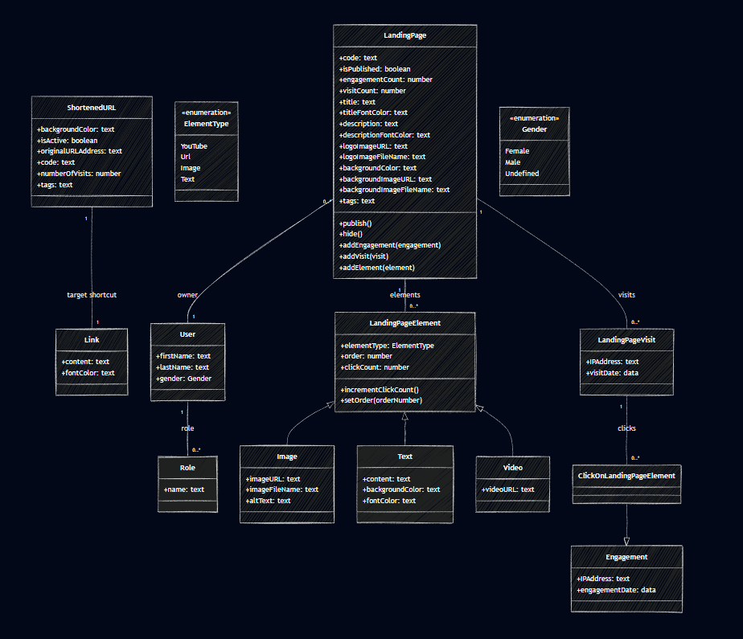

## Components Diagram

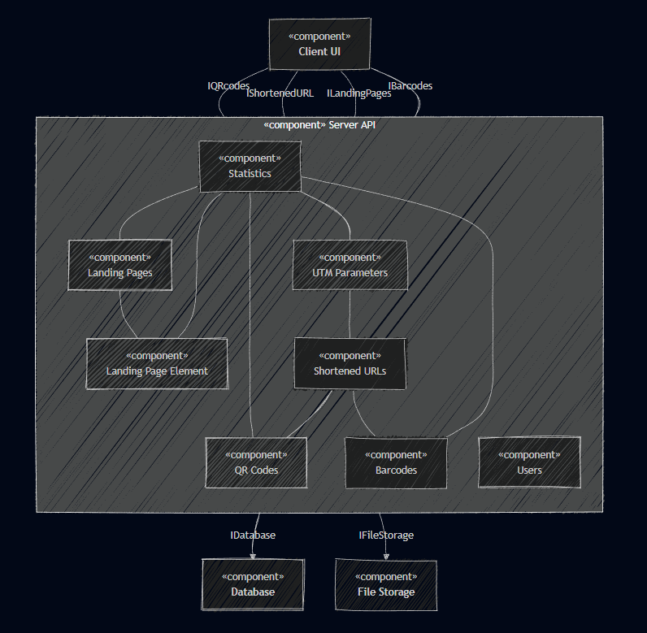

## Sequence Diagram

### Shorten URL

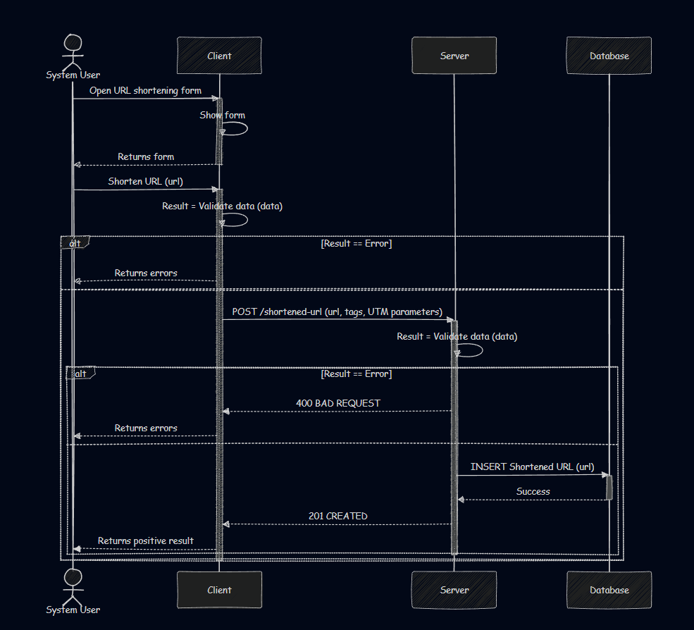

### Redirect

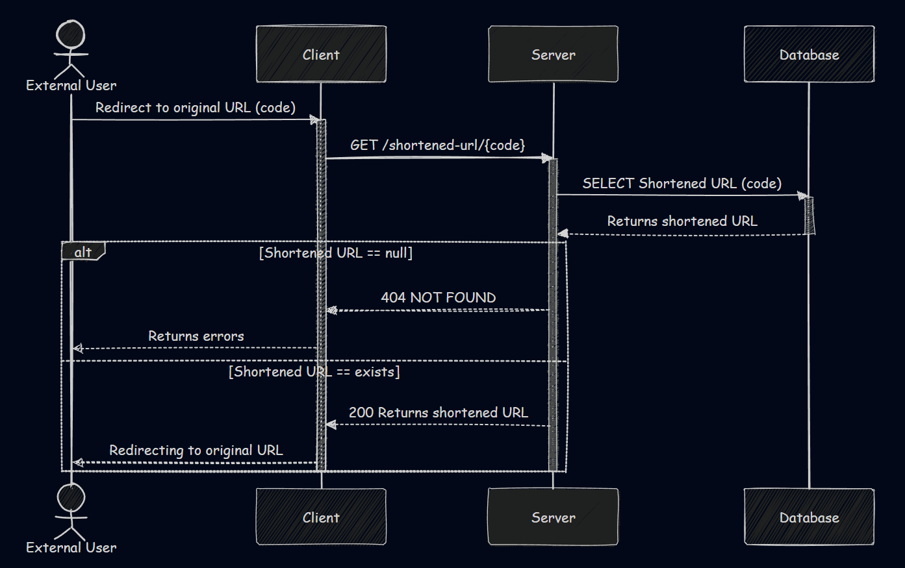

### Create landing page

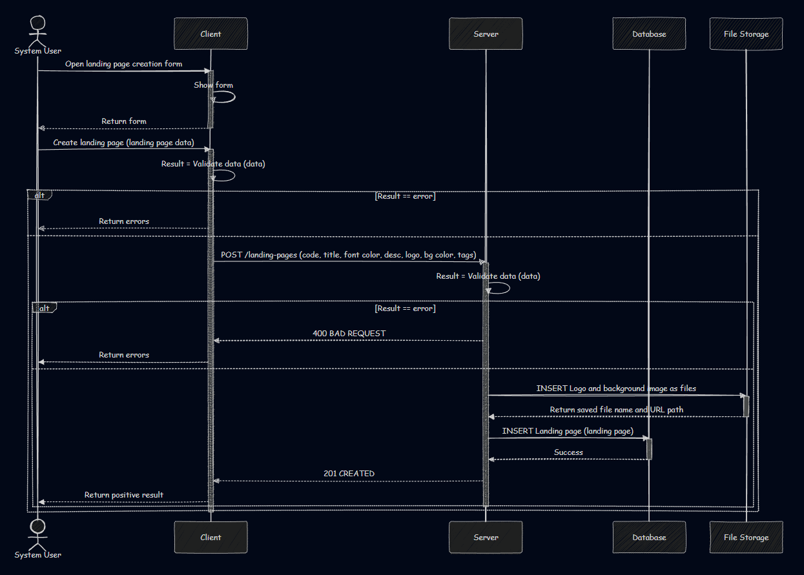

### Redirect to landing page

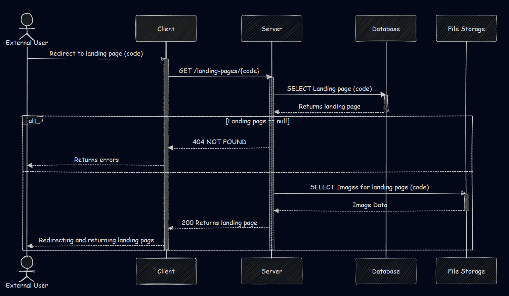

### Generate QR Code

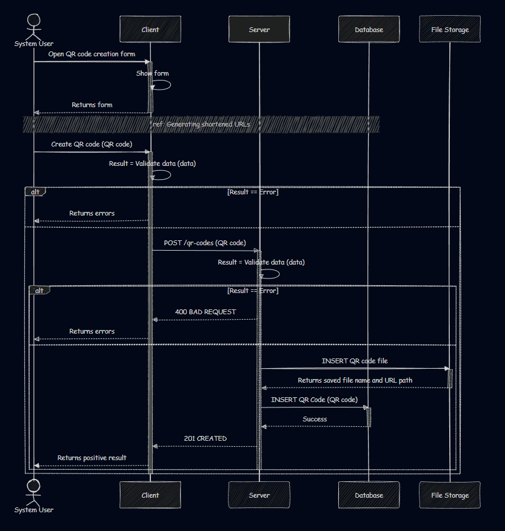

### Download QR Code

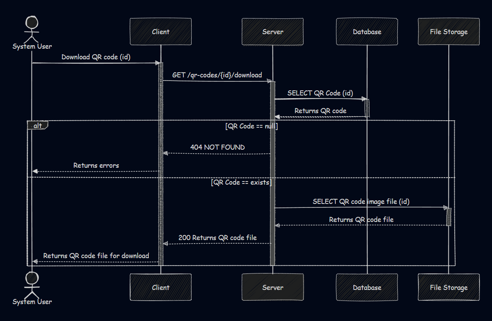

# Authentication

Linksy utilizes JWT (JSON Web Tokens) for secure and efficient authentication, ensuring that only authorized users can access the system. For authorization, the API implements Role-Based Access Control (RBAC), which assigns specific permissions and access levels based on the user's role within the system.

Tokens are stored in cookies which makes it easier to attach JWT in client HTTP requests without having to set required authorization headers. In addition, the system includes a refresh token mechanism that is invoked on every HTTP request which automatically renews the JWT shortly before it expires.

# FrontEnd

## Login page

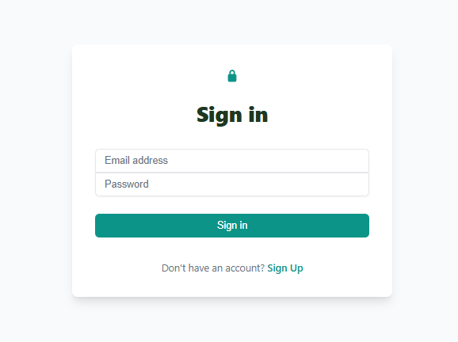

## List all shortened URLs page

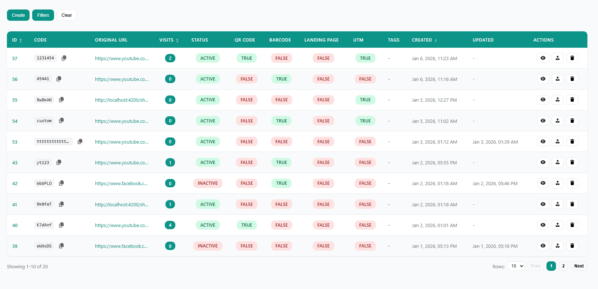

## Shortened URL details page

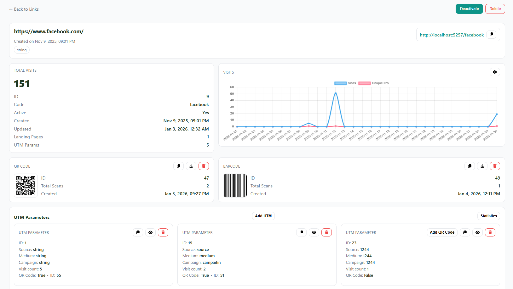

## Landing page details page

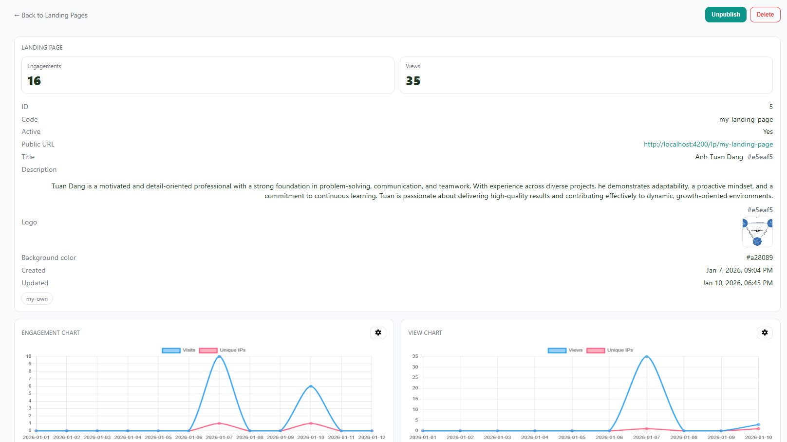

## Example landing page

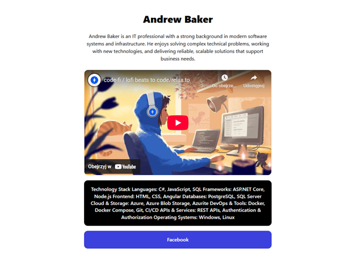

## QR Code details page

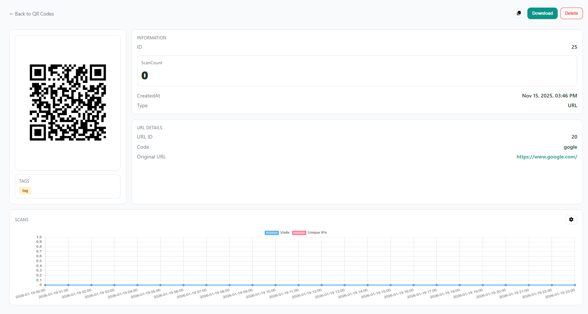

# BackEnd

## URLs

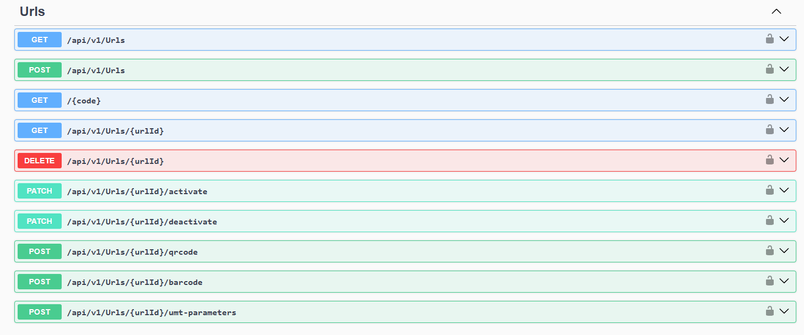

## Qr Codes

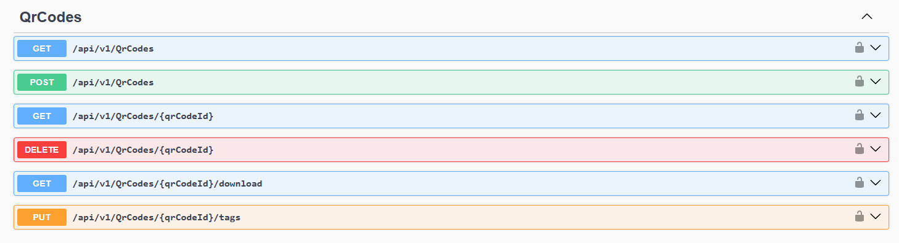

## Barcodes

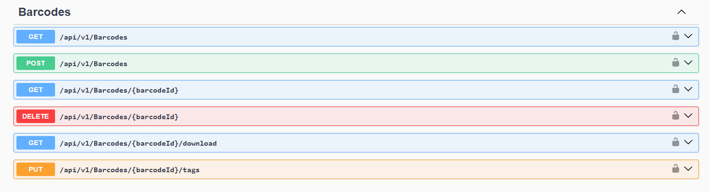

## UTM Parameters

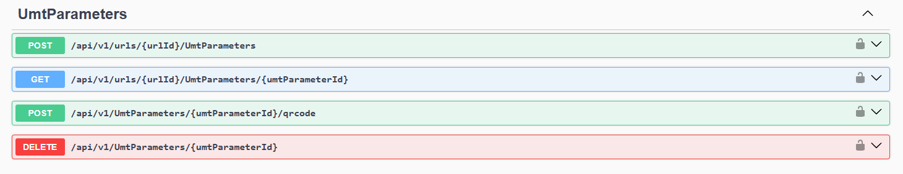

## Landing pages

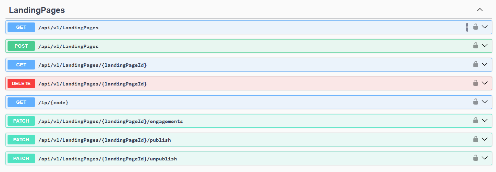

## Landing page elements

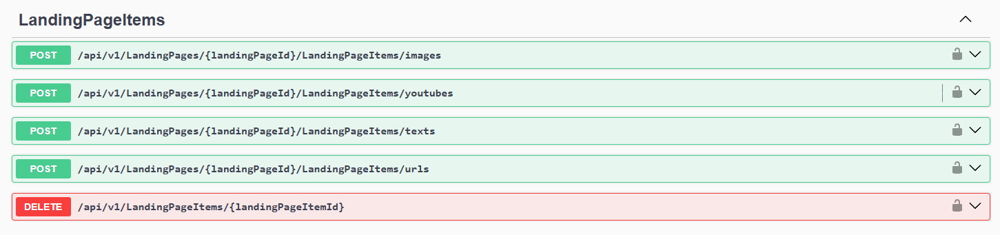

## Analytics

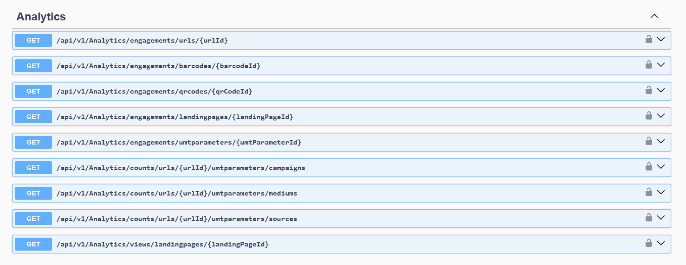

## Used .NET libraries

- ASP.NET Core Identity
- Entity Framework Core
- Npgsql
- Azure Storage Blobs
- Swashbuckle (Swagger)
- Asp.Versioning
- MediatR
- FluentValidation
- QRCoder
- BarcodeLib
- Scrutor

# Licence
The project is under [MIT license](https://opensource.org/license/MIT)
